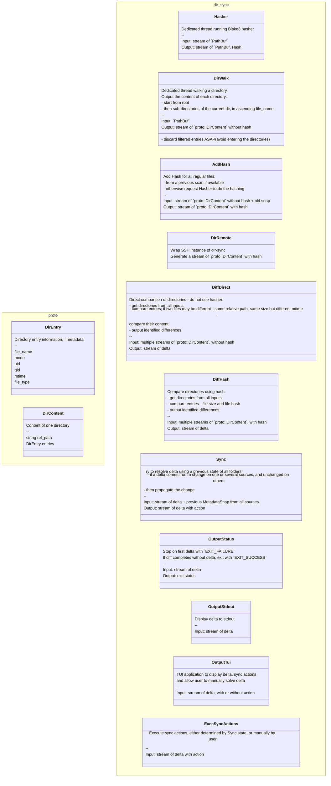
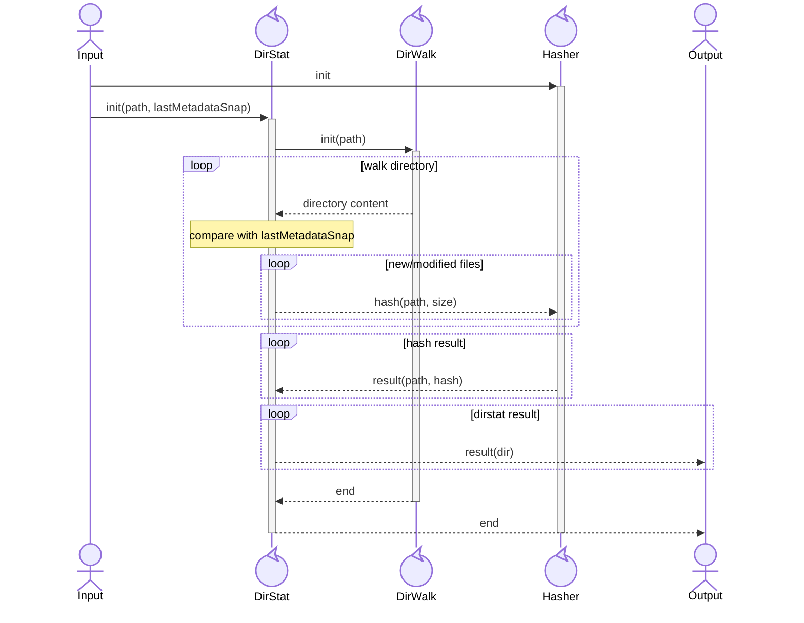
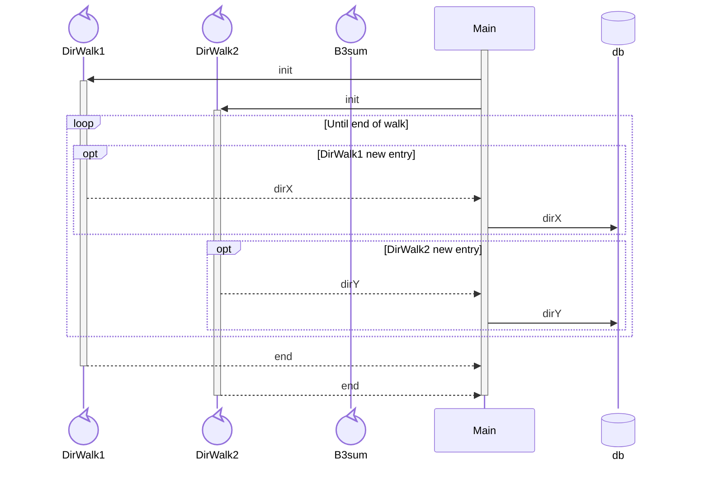

# Architecture

## Classes

## Pipeline

Pipeline is built based on the configuration, using the above bricks.

Examples:

- diff status: DirWalk + DiffDirect + OutputStatus
- sync batch: DirWalk + AddHash + DiffHash + Sync + ExecSyncActions
- TUI: DirWalk + AddHash + DiffHash + Sync + OutputTui + ExecSyncActions

## MetadataSnap

All metadata of the directory and its content

- name
- type
- regular: size + hash (if size > 0)
- directory: sorted list of entries
- symlink: content (=target)
- ctime
- mtime
- uid/gid (number)
- permissions

## Hasher

Use Blake3, much faster than others.

After benchmark, a single worker thread calling `update_mmap_rayon()` is the most efficient for all use cases.

## DirWalk

Dedicated thread walking a directory.

Input: path to directory
Output: Stream of `proto::DirContent`

## Direct comparison

When all `DirWalk` are local, hasher is not needed. In this case, a direct comparison can be made for regular files with same relative paths, same size but different mtime to check if the files are really different.

## Directory walking stage

Input: path to directory + last known MetadataSnap
Output: MetadataSnap of this directory (and content)

- one thread walking the directory: DirWalk
- single Hasher, shared between local DirWalk
- one task aggregating data: DirStat
  - data from DirWalk
  - compare with last known MetadataSnap
  - request hash to Hasher
  - collect hash results
  - send data to consumer

## Draft

- un thread qui parcourt un répertoire et envoie le contenu (fichier ? dossier ?)
- un thread/tache qui collecte le résultat
- consommateur ? fait le diff entre plusieurs répertoires (2 répertoires différents, ou même répertoire comparé avec un MetadataSnap passé)
  - demande un b3sum si besoin
  - reporte les différences

A la fin, on veut:

- vue de toute l'arborescence globale/unifiée, avec les points communs / delta
- arborescence limitée aux deltas/conflits
- pour chaque conflit, action automatique ou manuelle
- exécution des actions
- arbre résultant pour chaque source (on ne refait pas une passe)

Il faut un 1er étage:

- walk dir
- comparaison avec le dernier MetadataSnap connu
- b3sum des fichiers nouveaux ou modifiés
- sortie: MetadataSnap "current"

Ce même étage est fait en local ou à distance; dans les 2 cas; la sortie est le MetadataSnap (complet ou idéalement progressif)

