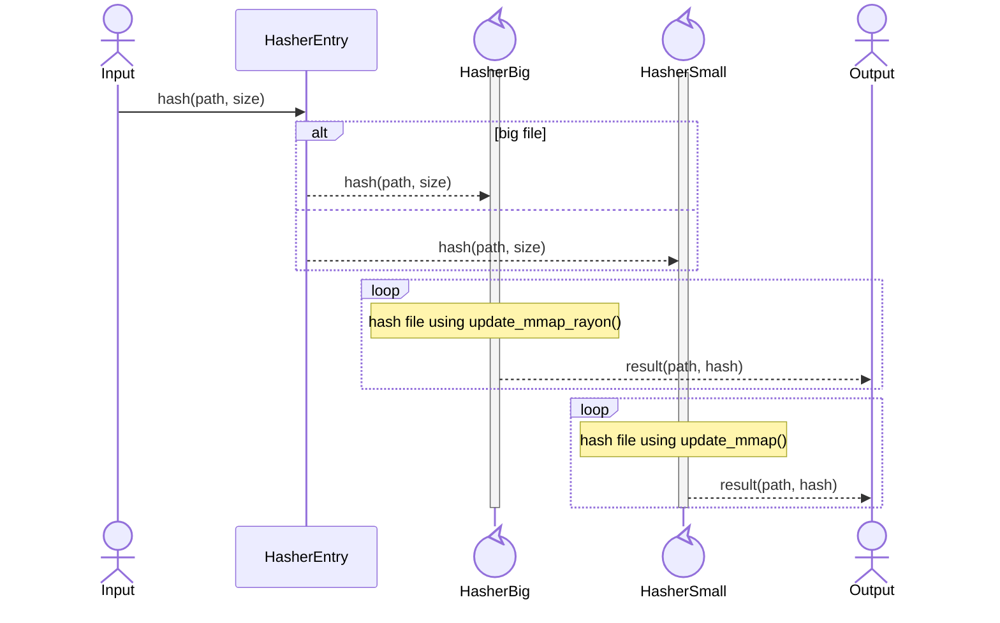
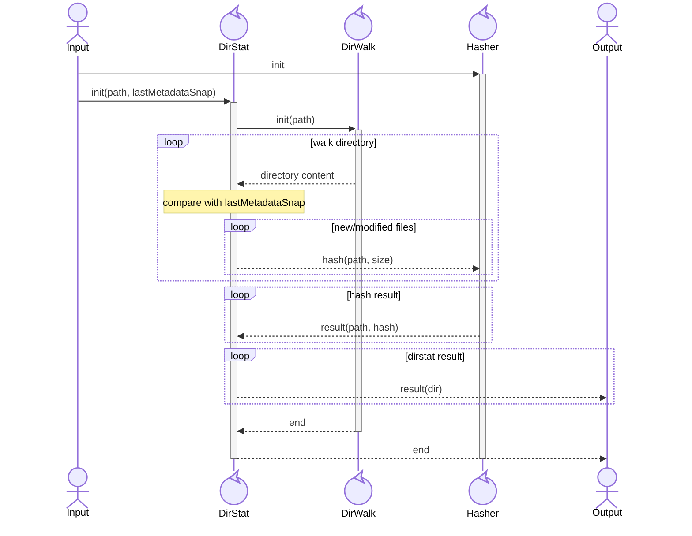
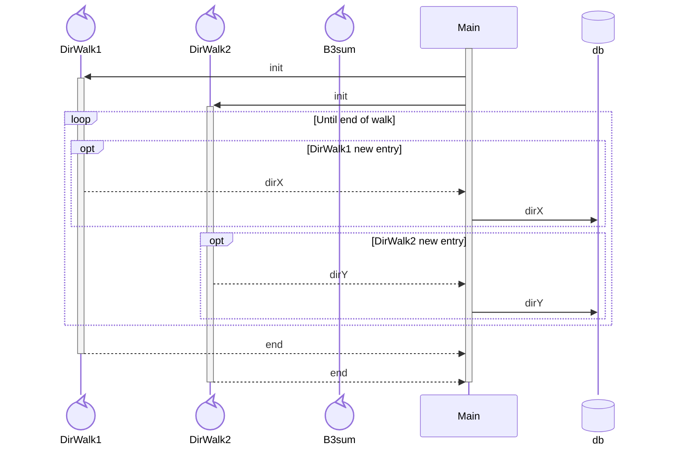

# Architecture

## MetadataSnap

All metadata of the directory and its content

- name
- type
- regular: size + hash (if size > 0)
- directory: sorted list of entries
- symlink: content (=target)
- ctime
- mtime
- uid/gid (number)
- permissions

## Hasher

Use Blake3, much faster than others

Several strategies, to be benchmarked:

- single thread using `update_mmap_rayon()`
- multiple threads using `update_mmap()`
- smart dispatch:
  - big files sent to a single thread using `update_mmap_rayon()`
  - small files sent to a multi thread worker using `update_mmap()`

Solution #1 may be faster on big files. And way faster on a single big file
Solution #2 allows to tune the number of threads and shall be faster on small files (IO is parallelized, useless rayon overload not present)

Solution #3 shall be the best of both worlds: single big file is fast, and multiple small files as well.

## Directory walking stage

Input: path to directory + last known MetadataSnap
Output: MetadataSnap of this directory (and content)

- one thread walking the directory: DirWalk
- single Hasher, shared between local DirWalk
- one task aggregating data: DirStat
  - data from DirWalk
  - compare with last known MetadataSnap
  - request hash to Hasher
  - collect hash results
  - send data to consumer

## Draft

- un thread qui parcourt un répertoire et envoie le contenu (fichier ? dossier ?)
- un thread/tache qui collecte le résultat
- consommateur ? fait le diff entre plusieurs répertoires (2 répertoires différents, ou même répertoire comparé avec un MetadataSnap passé)
  - demande un b3sum si besoin
  - reporte les différences

A la fin, on veut:

- vue de toute l'arborescence globale/unifiée, avec les points communs / delta
- arborescence limitée aux deltas/conflits
- pour chaque conflit, action automatique ou manuelle
- exécution des actions
- arbre résultant pour chaque source (on ne refait pas une passe)

Il faut un 1er étage:

- walk dir
- comparaison avec le dernier MetadataSnap connu
- b3sum des fichiers nouveaux ou modifiés
- sortie: MetadataSnap "current"

Ce même étage est fait en local ou à distance; dans les 2 cas; la sortie est le MetadataSnap (complet ou idéalement progressif)

